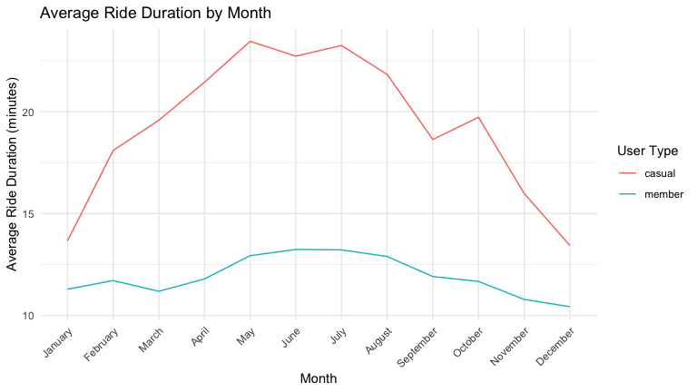
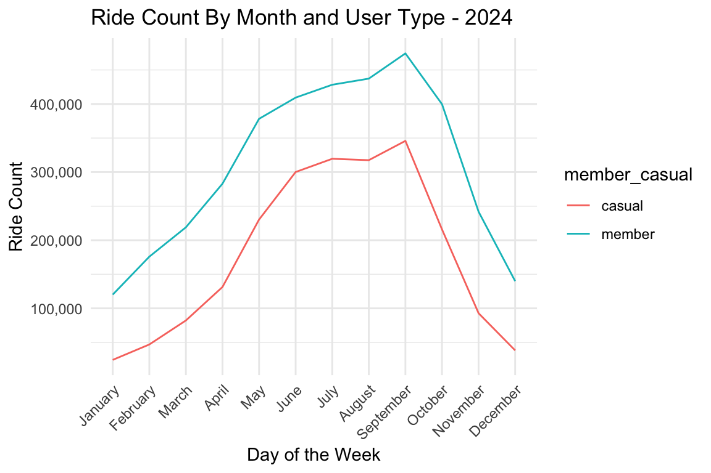
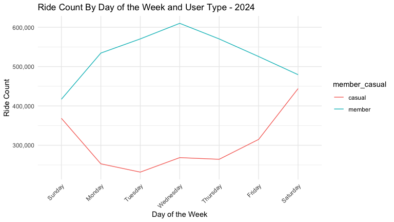
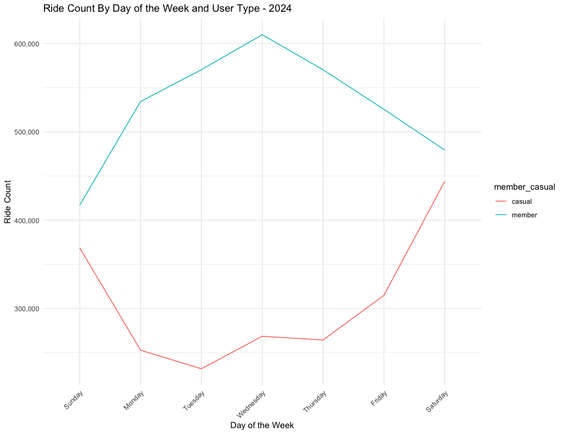
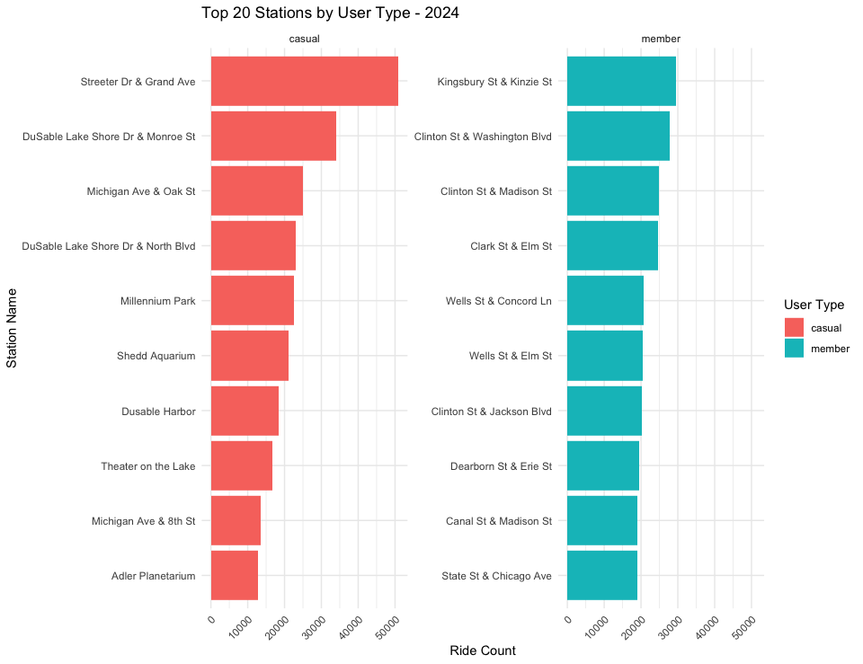
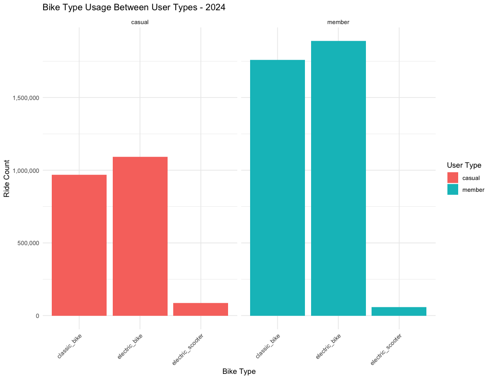

Cyclistic Case Study
================
2025-02-06

## Introduction

This capstone project is the final requirement for the Google Data
Analytics course, featuring a fictional bike-share company based in
Chicago called Cyclistic. The goal of this analysis is to support
Cyclist’s marketing team in developing a strategy to convert casual
riders into annual members. This study aims to identify key differences
in how casual riders and annual members use Cyclistic bikes. The data
analysis process—Ask, Prepare, Process, Analyze, Share, and Act—will
guide this project. The analysis will be conducted using R for data
cleaning, exploration, and visualization.

## Ask

Cyclistic aims to understand how annual members and casual riders differ
in their usage patterns. Annual members are currently more profitable
than casual riders, presenting an opportunity for growth through
targeted marketing strategies.

This analysis seeks to:

- Identify usage patterns, trip behaviors, and trends among casual
  riders and annual members
- Analyze 12 months of historical bike-share data to uncover key
  insights
- Provide data-driven recommendations to support the marketing team’s
  goal of increasing annual memberships

The final findings will be presented to the Marketing Director and the
Cyclistic Executive Team to inform strategic decisions.

## Prepare

load packages

``` r
library(tidyverse)
library(lubridate)
library(ggplot2)
library(readr)
library(janitor)
library(geosphere)
library(dplyr)
library(pastecs)
library(scales)
```

<br> Load data frames. I will be using the most recent data from the
last 12 months at the time of this report.

``` r
JAN_2024 <- read_csv("Data/202401-divvy-tripdata.csv")
FEB_2024 <- read_csv("Data/202402-divvy-tripdata.csv")
MAR_2024 <- read_csv("Data/202403-divvy-tripdata.csv")
APR_2024 <- read_csv("Data/202404-divvy-tripdata.csv")
MAY_2024 <- read_csv("Data/202405-divvy-tripdata.csv")
JUN_2024 <- read_csv("Data/202406-divvy-tripdata.csv")
JUL_2024 <- read_csv("Data/202407-divvy-tripdata.csv")
AUG_2024 <- read_csv("Data/202408-divvy-tripdata.csv")
SEP_2024 <- read_csv("Data/202409-divvy-tripdata.csv")
NOV_2024 <- read_csv("Data/202411-divvy-tripdata.csv")
OCT_2024 <- read_csv("Data/202410-divvy-tripdata.csv")
DEC_2024 <- read_csv("Data/202412-divvy-tripdata.csv")
```

## Process

Compares columns names/type across multiple data frames. This confirms
that the column names and data types are consistent across all data
frames used.

``` r
compare_df_cols(JAN_2024, FEB_2024, MAR_2024, APR_2024, MAY_2024, JUN_2024, JUL_2024, AUG_2024, SEP_2024, OCT_2024, NOV_2024, DEC_2024)
```

    ##           column_name        JAN_2024        FEB_2024        MAR_2024
    ## 1             end_lat         numeric         numeric         numeric
    ## 2             end_lng         numeric         numeric         numeric
    ## 3      end_station_id       character       character       character
    ## 4    end_station_name       character       character       character
    ## 5            ended_at POSIXct, POSIXt POSIXct, POSIXt POSIXct, POSIXt
    ## 6       member_casual       character       character       character
    ## 7             ride_id       character       character       character
    ## 8       rideable_type       character       character       character
    ## 9           start_lat         numeric         numeric         numeric
    ## 10          start_lng         numeric         numeric         numeric
    ## 11   start_station_id       character       character       character
    ## 12 start_station_name       character       character       character
    ## 13         started_at POSIXct, POSIXt POSIXct, POSIXt POSIXct, POSIXt
    ##           APR_2024        MAY_2024        JUN_2024        JUL_2024
    ## 1          numeric         numeric         numeric         numeric
    ## 2          numeric         numeric         numeric         numeric
    ## 3        character       character       character       character
    ## 4        character       character       character       character
    ## 5  POSIXct, POSIXt POSIXct, POSIXt POSIXct, POSIXt POSIXct, POSIXt
    ## 6        character       character       character       character
    ## 7        character       character       character       character
    ## 8        character       character       character       character
    ## 9          numeric         numeric         numeric         numeric
    ## 10         numeric         numeric         numeric         numeric
    ## 11       character       character       character       character
    ## 12       character       character       character       character
    ## 13 POSIXct, POSIXt POSIXct, POSIXt POSIXct, POSIXt POSIXct, POSIXt
    ##           AUG_2024        SEP_2024        OCT_2024        NOV_2024
    ## 1          numeric         numeric         numeric         numeric
    ## 2          numeric         numeric         numeric         numeric
    ## 3        character       character       character       character
    ## 4        character       character       character       character
    ## 5  POSIXct, POSIXt POSIXct, POSIXt POSIXct, POSIXt POSIXct, POSIXt
    ## 6        character       character       character       character
    ## 7        character       character       character       character
    ## 8        character       character       character       character
    ## 9          numeric         numeric         numeric         numeric
    ## 10         numeric         numeric         numeric         numeric
    ## 11       character       character       character       character
    ## 12       character       character       character       character
    ## 13 POSIXct, POSIXt POSIXct, POSIXt POSIXct, POSIXt POSIXct, POSIXt
    ##           DEC_2024
    ## 1          numeric
    ## 2          numeric
    ## 3        character
    ## 4        character
    ## 5  POSIXct, POSIXt
    ## 6        character
    ## 7        character
    ## 8        character
    ## 9          numeric
    ## 10         numeric
    ## 11       character
    ## 12       character
    ## 13 POSIXct, POSIXt

<br> Merge all 12 data frames for 2024 together.

``` r
#merge 2024 data frames together
merged_2024 <- bind_rows(JAN_2024, FEB_2024, MAR_2024, APR_2024, MAY_2024, JUN_2024, JUL_2024, AUG_2024, SEP_2024, OCT_2024, NOV_2024, DEC_2024)
```

<br> Count the number of n/a values in each column. This results in
about 18-19% of missing data from station names and station id. I will
not be removing the data because it is non-essential data for this
analysis that will mainly focus on ride patterns rather than specific
stations.

``` r
#count n/a values in column
colSums(is.na(merged_2024))
```

    ##            ride_id      rideable_type         started_at           ended_at 
    ##                  0                  0                  0                  0 
    ## start_station_name   start_station_id   end_station_name     end_station_id 
    ##            1073951            1073951            1104653            1104653 
    ##          start_lat          start_lng            end_lat            end_lng 
    ##                  0                  0               7232               7232 
    ##      member_casual 
    ##                  0

<br> Add column to calculate a trips ride time in minutes by finding the
time difference between started_at and ended_at column.

``` r
merged_2024 <- merged_2024 %>%
  distinct() %>% #remove duplicates
  mutate(ride_time_min = difftime(ended_at, started_at, units = "min")) %>%  #add column that calculates the ride time in minutes
  arrange(desc(ride_time_min)) %>% 
  mutate(day_of_week = wday(started_at, label = TRUE, abbr = FALSE)) %>% #add date_of_week column 
  mutate(ride_month = month(started_at, label = TRUE, abbr = FALSE)) #add ride_month column 
```

\#remove negative values in ride_time_min column and ride times greater
than 24 hrs.

``` r
#remove negative values in ride_time_min column and ride times greater than 24 hrs.
merged_2024 <- merged_2024 %>%  
  filter(ride_time_min > 0, ride_time_min <= 1440)
```

# Analyze

Perform description analysis on ride_time_min column across all users.

- Minimum ride time is 0. This demonstrates that users are quickly
  un-docking and re-docking bikes without starting a ride.
- Max ride time is 1439 min. Rides longer than 1440 min (24 hrs) have
  been removed from the data.
- Median ride time is 9.70 min. Many users are taking shorter trips.
- Mean is 15.40 which is larger than the medium. Data is right skewed
  with users with very long ride times.

``` r
round(stat.desc(merged_2024$ride_time_min), 2)
```

    ##                        x
    ## nbr.val       5852249.00
    ## nbr.null            0.00
    ## nbr.na              0.00
    ## min                 0.00
    ## max              1439.93
    ## range            1439.93
    ## sum          90098575.60
    ## median              9.70
    ## mean               15.40
    ## SE.mean             0.01
    ## CI.mean.0.95        0.02
    ## var               944.14
    ## std.dev            30.73
    ## coef.var            2.00

<br> Perform descriptive statistical analysis on ride_time_min column by
user type.

- Total Rides: Members make up 63.3% of total rides with 3,707,005 rides
  versus 2,145,244 rides for casual users.
- Casual riders take longer rides than members with a higher mean
  (12.02) and median (20.93 min) compared to members.
- Casual riders have a higher standard deviation (42.46 min), meaning
  their ride times vary widely.

``` r
# Descriptive statistics for members
round(stat.desc(merged_2024$ride_time_min[merged_2024$member_casual == "member"]),2)
```

    ##                        x
    ## nbr.val       3707005.00
    ## nbr.null            0.00
    ## nbr.na              0.00
    ## min                 0.00
    ## max              1439.93
    ## range            1439.93
    ## sum          45207002.44
    ## median              8.69
    ## mean               12.20
    ## SE.mean             0.01
    ## CI.mean.0.95        0.02
    ## var               419.12
    ## std.dev            20.47
    ## coef.var            1.68

``` r
# Descriptive statistics for casual users
round(stat.desc(merged_2024$ride_time_min[merged_2024$member_casual == "casual"]), 2)
```

    ##                        x
    ## nbr.val       2145244.00
    ## nbr.null            0.00
    ## nbr.na              0.00
    ## min                 0.00
    ## max              1439.93
    ## range            1439.93
    ## sum          44891573.16
    ## median             12.02
    ## mean               20.93
    ## SE.mean             0.03
    ## CI.mean.0.95        0.06
    ## var              1803.10
    ## std.dev            42.46
    ## coef.var            2.03

``` r
#calculate avg ride_time by month and user type
ride_time_month <- merged_2024 %>% 
  group_by(member_casual, ride_month) %>% 
  summarise(mean = mean(ride_time_min))
```

    ## `summarise()` has grouped output by 'member_casual'. You can override using the
    ## `.groups` argument.

``` r
as_tibble(ride_time_month)
```

    ## # A tibble: 24 × 3
    ##    member_casual ride_month mean         
    ##    <chr>         <ord>      <drtn>       
    ##  1 casual        January    13.66143 mins
    ##  2 casual        February   18.09625 mins
    ##  3 casual        March      19.58065 mins
    ##  4 casual        April      21.44337 mins
    ##  5 casual        May        23.45044 mins
    ##  6 casual        June       22.72396 mins
    ##  7 casual        July       23.24570 mins
    ##  8 casual        August     21.82665 mins
    ##  9 casual        September  18.63685 mins
    ## 10 casual        October    19.72420 mins
    ## # ℹ 14 more rows

``` r
#calculate count of rides by month and user type
num_rides_month <- merged_2024 %>% 
  count(member_casual, ride_month, name = "num_rides")

as_tibble(num_rides_month)
```

    ## # A tibble: 24 × 3
    ##    member_casual ride_month num_rides
    ##    <chr>         <ord>          <int>
    ##  1 casual        January        24320
    ##  2 casual        February       46931
    ##  3 casual        March          82200
    ##  4 casual        April         131337
    ##  5 casual        May           230327
    ##  6 casual        June          300153
    ##  7 casual        July          319560
    ##  8 casual        August        317542
    ##  9 casual        September     345854
    ## 10 casual        October       215933
    ## # ℹ 14 more rows

``` r
#find top 20 start stations
top_stations <- merged_2024 %>% 
  count(member_casual, start_station_name, name = "station_count") %>% 
  arrange(desc(station_count)) %>% 
  filter(!is.na(start_station_name)) %>% 
  group_by(member_casual) %>% 
  top_n(10, station_count)

as_tibble(top_stations)
```

    ## # A tibble: 20 × 3
    ##    member_casual start_station_name                 station_count
    ##    <chr>         <chr>                                      <int>
    ##  1 casual        Streeter Dr & Grand Ave                    50903
    ##  2 casual        DuSable Lake Shore Dr & Monroe St          33965
    ##  3 member        Kingsbury St & Kinzie St                   29515
    ##  4 member        Clinton St & Washington Blvd               27729
    ##  5 casual        Michigan Ave & Oak St                      25058
    ##  6 member        Clinton St & Madison St                    24886
    ##  7 member        Clark St & Elm St                          24703
    ##  8 casual        DuSable Lake Shore Dr & North Blvd         23033
    ##  9 casual        Millennium Park                            22498
    ## 10 casual        Shedd Aquarium                             21020
    ## 11 member        Wells St & Concord Ln                      20667
    ## 12 member        Wells St & Elm St                          20489
    ## 13 member        Clinton St & Jackson Blvd                  20301
    ## 14 member        Dearborn St & Erie St                      19484
    ## 15 member        Canal St & Madison St                      19076
    ## 16 member        State St & Chicago Ave                     19054
    ## 17 casual        Dusable Harbor                             18390
    ## 18 casual        Theater on the Lake                        16773
    ## 19 casual        Michigan Ave & 8th St                      13456
    ## 20 casual        Adler Planetarium                          12879

``` r
#Bike type usage between casual and member riders
bike_type <- merged_2024 %>% 
  group_by(member_casual, rideable_type) %>% 
  summarize(count = n())
```

    ## `summarise()` has grouped output by 'member_casual'. You can override using the
    ## `.groups` argument.

``` r
as_tibble(bike_type)
```

    ## # A tibble: 6 × 3
    ##   member_casual rideable_type      count
    ##   <chr>         <chr>              <int>
    ## 1 casual        classic_bike      968778
    ## 2 casual        electric_bike    1091251
    ## 3 casual        electric_scooter   85215
    ## 4 member        classic_bike     1759184
    ## 5 member        electric_bike    1888699
    ## 6 member        electric_scooter   59122

``` r
#Ride counts by day of the week
table(merged_2024$day_of_week)
```

    ## 
    ##    Sunday    Monday   Tuesday Wednesday  Thursday    Friday  Saturday 
    ##    785568    787244    802204    878586    834701    840501    923445

``` r
day_count <- merged_2024 %>% 
    group_by(member_casual, day_of_week) %>% 
    summarize(ride_count = n())
```

    ## `summarise()` has grouped output by 'member_casual'. You can override using the
    ## `.groups` argument.

``` r
as_tibble(day_count)
```

    ## # A tibble: 14 × 3
    ##    member_casual day_of_week ride_count
    ##    <chr>         <ord>            <int>
    ##  1 casual        Sunday          368571
    ##  2 casual        Monday          252900
    ##  3 casual        Tuesday         231817
    ##  4 casual        Wednesday       268632
    ##  5 casual        Thursday        264401
    ##  6 casual        Friday          314918
    ##  7 casual        Saturday        444005
    ##  8 member        Sunday          416997
    ##  9 member        Monday          534344
    ## 10 member        Tuesday         570387
    ## 11 member        Wednesday       609954
    ## 12 member        Thursday        570300
    ## 13 member        Friday          525583
    ## 14 member        Saturday        479440

``` r
#ride count by month
month_count <- merged_2024 %>% 
  group_by(member_casual, ride_month) %>% 
  summarize(ride_count = n())
```

    ## `summarise()` has grouped output by 'member_casual'. You can override using the
    ## `.groups` argument.

``` r
as_tibble(month_count)
```

    ## # A tibble: 24 × 3
    ##    member_casual ride_month ride_count
    ##    <chr>         <ord>           <int>
    ##  1 casual        January         24320
    ##  2 casual        February        46931
    ##  3 casual        March           82200
    ##  4 casual        April          131337
    ##  5 casual        May            230327
    ##  6 casual        June           300153
    ##  7 casual        July           319560
    ##  8 casual        August         317542
    ##  9 casual        September      345854
    ## 10 casual        October        215933
    ## # ℹ 14 more rows

# Share

``` r
merged_2024_filtered_ride_time <- merged_2024 %>%
  filter(ride_time_min <= 70)

ggplot(merged_2024_filtered_ride_time, aes(x = ride_time_min, fill=member_casual)) +
  geom_histogram(binwidth = 5) +
  scale_y_continuous(labels = comma) +
  scale_x_continuous() +
  theme_minimal() +
   labs(title = "Distribution of Ride Duration by Member and Casual Users",
       x = "Ride Duration",
       y = "Count",
      color = "User Type")
```

<!-- -->

``` r
quantile(merged_2024$ride_time_min, probs = c(0.95, 0.99, 0.999), na.rm = TRUE)
```

    ## Time differences in mins
    ##       95%       99%     99.9% 
    ##  42.23854  94.68717 333.38253

``` r
merged_2024_filtered_ride_time <- merged_2024 %>%
  filter(ride_time_min <= 42.2)

ggplot(merged_2024_filtered_ride_time, aes(ride_time_min, color=member_casual)) + 
  geom_density() +
  xlim(0, 42.2) +
  theme_minimal() +
  labs(title = "Ride Duration Density by Member and Casual Users",
       x = "Ride Duration",
       y = "Density",
      color = "User Type")
```

<!-- -->

This demonstrates that casual members have a higher ride duration
throughout the year compared to members. This suggests that casual
riders are using the bikes more for leisure and are opting more for the
full-day passes. The months with the highest ride duration are the
summer months May through July. The winter months Nov - Jan have the
lowest ride duration. For members, the increase in ride duration during
peak months do not increase as much casual riders, meaning they are more
consistent with their ride duration throughout the year.

``` r
#plots the average ride duration by month between casual and members
ggplot(ride_time_month, aes(x = ride_month, y = mean, color = member_casual, group = member_casual)) +
  geom_line() + 
  labs(title = "Average Ride Duration by Month",
       x = "Month",
       y = "Average Ride Duration (minutes)",
       color = "User Type") +
  theme_minimal() +
  theme(axis.text.x = element_text(angle = 45, hjust = 1))
```

    ## Don't know how to automatically pick scale for object of type <difftime>.
    ## Defaulting to continuous.

<!-- -->

Although members are taking shorter rides, they are taking more rides
than casual users. Number of rides increase for all users with the
highest months in June - September with a sharp dip in rides from Nov to
Jan. 

``` r
  ggplot(month_count, aes(x = ride_month, y = ride_count, , color = member_casual, group = member_casual)) + 
    geom_line() +
    scale_y_continuous(labels = comma) +
    labs(title = "Ride Count By Month and User Type - 2024", 
         x = "Day of the Week", 
         y = "Ride Count",
         fill = "User Type") +
    theme_minimal() +
    theme(axis.text.x = element_text(angle = 45, hjust = 1))
```

<!-- -->

On a weekly basis, members take more rides on the weekday and casual
members take more rides on the weekends.

``` r
  ggplot(day_count, aes(x = day_of_week, y = ride_count, , color = member_casual, group = member_casual)) + 
    geom_line() +
    scale_y_continuous(labels = comma) +
    labs(title = "Ride Count By Day of the Week and User Type - 2024", 
         x = "Day of the Week", 
         y = "Ride Count",
         fill = "User Type") +
    theme_minimal() +
   theme(axis.text.x = element_text(angle = 45, hjust = 1))
```

<!-- -->

The top 20 start stations for casual members show they are starting
their rides around popular tourist areas.

``` r
#Bar chart for top start stations between casual and member riders
ggplot(top_stations, aes(x = reorder(start_station_name, station_count), y = station_count, fill = member_casual)) +
  geom_col() +
  coord_flip() +
  facet_wrap(~ member_casual, scales = "free_y") +
  labs(title = "Top 20 Stations by User Type - 2024", 
       x = "Station Name", 
       y = "Ride Count",
       fill="User Type") +
  theme_minimal() +
  theme(axis.text.x = element_text(angle = 45, hjust = 1))
```

<!-- -->

Most popular bike types for all members are the electric bikes followed
by classic bikes. Electric scooters are not that popular but will need
to investigate if this is due to availability.

``` r
#Barchart of bike type usage between users
bike_type_plot <- ggplot(bike_type, aes(x = rideable_type, y = count, fill = member_casual)) +
  geom_col() +
  scale_y_continuous(labels = comma) +
  facet_wrap(~member_casual) + 
  labs(title = "Bike Type Usage Between User Types - 2024", 
       x = "Bike Type", 
       y = "Ride Count",
       fill = "User Type")+
  theme_minimal() +
  theme(axis.text.x = element_text(angle = 45, hjust = 1))

#ggsave("plots/bike_type_usage.png", plot = bike_type_plot, width = 6, height = 4, dpi = 300)

bike_type_plot
```

<!-- -->

# Recommendation

1.  Concentrate marketing efforts geared towards casual riders at
    popular stations.

- Offer discounts for annual memberships at these locations
- Consider offering discounted full-day membership packs for casual
  users who do not live in the city, but come often enough for leisure
  on the weekends. For exaample, 10 pack of full day rides.

2.  
